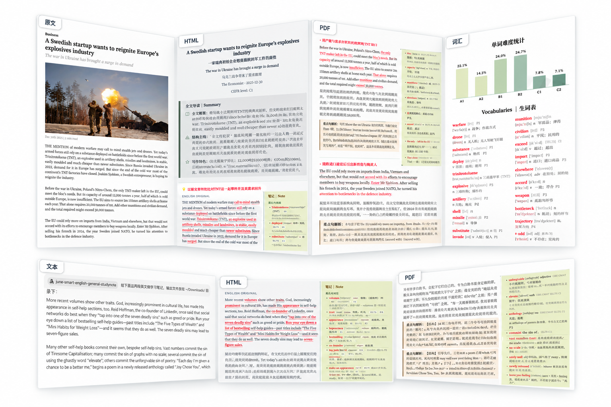

# June Smart English General Studynote

一个面向简体中文英语学习者的英文文章、段落精读 Skill。

它可以把英文文章转换为结构化的双语学习资料，自动完成段落翻译、词汇与短语讲解、长难句分析、段落功能分析、CEFR 难度判断、英式 IPA 查询，输出 HTML / PDF 学习笔记。

**使用限制：本项目采用 [JEnglish 非商业使用许可 1.0](LICENSE)，仅限个人学习、非商业教学和研究等非商业用途。未经作者书面授权，不得用于任何商业产品、付费服务、收费课程、商业内容生产、商业 API / SaaS、企业商业部署或其他直接或间接营利活动。完整条款见 LICENSE。**

## 主要功能

- 支持输入：文本型 PDF、DOCX、TXT，以及直接粘贴的英文文章、段落。
- 能保留原文标题、副标题、1–3 级标题、段落顺序和可靠的斜体信息。
- 生成完整的中英双语精读笔记。
- 为每个段落生成自然中文翻译和段落功能分析、自动提取重点词汇与短语。
- 结合CET-4/6 和考研大纲词汇、CEFR 数据对全文实义单词进行分析，生词词汇表和A1–C2 词汇难度分布图。
- 生成文章整体 CEFR 阅读难度判断。
- 生词表音标为 British English IPA，IPA 来自词典或可靠外部证据，非大模型。
- 输出经过排版的学习版 HTML 和 PDF。

## 输出示例



## 支持的 Agent

| Agent / Harness  | 支持情况 | 推荐安装方式                                  |
| ---------------- | -------- | --------------------------------------------- |
| ChatGPT Web      | ✅        | 上传 Release ZIP                              |
| ChatGPT Desktop  | ✅        | 从 Skills 页面安装 / 上传 Release ZIP         |
| DeepSeek Harness | ✅        | 放入项目级或用户级 Skills 目录                |
| WorkBuddy        | ✅        | 从 Skills 界面导入 Release ZIP                |
| Claude Code      | ✅        | 放入 `.claude/skills/` 或 `~/.claude/skills/` |

> 不同 Agent 的代码执行、网络访问、PDF 解析并不完全相同，因此“兼容同一 Skill”不代表每个平台的运行环境完全一致。Skill 内置了 preflight、验证和降级逻辑；如果某项能力不可用，应只影响对应功能，模型不会自行伪造结果。

## 安装与使用

### 1. ChatGPT Web

#### 安装

1. 从本仓库的 Releases (https://github.com/EnglishJune/june-english-studynotes/releases) 下载最新 Skill ZIP。
3. 打开 ChatGPT 网页版。
4. 在左侧边栏进入 **Plugins（插件）**。
5. 打开 **Skills（技能）**。
6. 选择 **Create（创建） → Upload from your computer（从电脑上传）**。
7. 选择下载的 ZIP 文件。
8. ChatGPT 会对 Skill 进行扫描；如果出现 `Needs Review`，请先查看提示内容再启用。

如果你的账号中看不到 Skills 或 Upload 入口，通常与当前套餐、工作区权限、管理员设置或功能开放范围有关，以 ChatGPT 当前界面为准。

#### 使用

(1) 在聊天窗口上传英文文章，然后用提出任务，例如：

```text
用 @June Smart English General Studynote 给这篇文章生成学习笔记。
```

(2) 当直接在聊天窗口输入文本时：

```text
用 @June Smart English General Studynote 给下面以下英文做学习笔记:
XXXXXXXXXX
XXXXXXXXXX
```

> ChatGPT 安装 skill 成功后，@June Smart English General Studynote 会跳出这个 skill 的提示，点击即可。
>

### 2. ChatGPT Desktop

#### 安装

打开桌面版 ChatGPT，新开一个 chat，把下面的指令告诉它，让它自己安装：

```
请安装这个 Skill 的最新版本：https://github.com/EnglishJune/june-english-studynotes/releases
```

安装成功后，在聊天窗口输入 @June Smart English General Studynote 会自动补全这个 skill 名称。

#### 使用

使用方式和网页版类似，但可以指定输出文件目录。添加 PDF、DOCX 或 TXT 后，告诉它：

```text
用 @June Smart English General Studynote 给这篇文章生成学习笔记，输出文件存放在 XXX 文件夹里。
```

> ChatGPT Desktop 需要设置 network: Setting → Configuration → Local network access: On, Local web search: Live. 
>
> Model 选择 Sol/Terra High 已足够，不需要太消耗额度的模型。

### 3. DeepSeek Harness

#### 安装

> DeepSeek Harness 已有桌面版 https://www.deepseek.com/en/harness/, 需配置 DeepSeek API，具体安装和配置请自行查询。

在 Git 项目根目录中创建：

```text
.agents/skills/
```

然后把 Skill 的 zip 文件解压后整个文件夹复制进去：

```text
<project>/
└── .agents/
    └── skills/
        └── june-smart-english-general-studynote/
            ├── SKILL.md
            ├── scripts/
            ├── references/
            ├── assets/
            └── ...
```

DeepSeek Harness 也支持自己的项目级目录：

```text
<project>/.dsh/skills/
```

#### 使用

进入对应项目后启动 DeepSeek Harness，然后直接提出任务，例如：

```text
使用 june-smart-english-general-studynote 给这篇英文文章制作学习笔记，必须严格按照 skill 设定执行，有任何需求先和我确认，不能擅自决定，输出文件保存在 XXX。
```

---

### 4. WorkBuddy

*WorkBuddy 现有免费额度，新用户注册可使用我的邀请链接(互相可增加积分): https://www.workbuddy.cn/events/invite?inviteCode=5z9x7sjq5*

#### 安装：

打开 WorkBuddy

```text
Experts · Skills · Connectors → Skills → Add Skills → Upload skill → 把下载的 skill 的 zip 文件直接拖到弹出的对话框，跳过安全检查即可。
```

安装成功后，右上角 Installed 里可看到对应 skill。

#### 使用：

新建 task，选择可用模型，在对话框左下角 "+" 点开可添加 skill 到对话框，在对话框中上传文章，并告诉它：

```text
给这篇英文文章制作学习笔记，输出文件放在 XXX 文件夹中。
```

### 5. Claude Code （不推荐）

#### 个人全局安装

把整个 Skill 解压文件夹复制到：

```text
~/.claude/skills/june-smart-english-general-studynote/
```

例如：

```bash
mkdir -p ~/.claude/skills
cp -R june-smart-english-general-studynote ~/.claude/skills/
```

这样可以在多个项目中使用。

#### 项目级安装

如果只希望在某一个项目中使用：

```text
<project>/.claude/skills/june-smart-english-general-studynote/
```

项目级 Skill 可以跟随 Git 仓库一起管理。

#### 使用

Claude Code 会在任务相关时自动发现 Skill，再告诉它：

```text
给这篇英文文章制作学习笔记，输出文件放在 XXX 文件夹中。
```

## 本地运行环境说明

这个 Skill 包含 Python scripts。不同 Agent 的托管环境可能已经提供所需依赖；如果是在本地 Harness / Claude Code 等环境运行，可以先执行：

```bash
python scripts/preflight.py
```

主要 Python 依赖包括：

```text
jsonschema
python-docx
requests
fonttools
```

CEFR 词汇统计图还需要：

```text
matplotlib
```

如果希望完全在本地生成 PDF，需要可用的：

```text
XeLaTeX
```

Skill 的 preflight **不会自动安装依赖，也不会擅自修改你的 Python 环境**。

## 外部网络说明

本 skill 需要 API 传输数据，因此在各 Agents 中需要把 public network 设置为可用；否则将无法生成 PDF 版笔记。

不同 Agent 是否允许联网取决于其自身权限和运行环境。

## 非商业使用许可

本项目的作者原创部分采用自定义的 **JEnglish 非商业使用许可 1.0（JEnglish Noncommercial License 1.0）**，不是 MIT 许可证。以下为使用限制摘要，完整授权条件以仓库根目录的 [LICENSE](LICENSE) 为准。

本项目的作者原创部分允许：

- 个人学习；
- 非商业教学；
- 非商业学术研究；
- 非营利性质的测试、修改和二次开发；
- 在遵守本使用限制的前提下 Fork、研究和贡献代码。

未经作者事先书面授权，**禁止任何商业使用**，包括但不限于：

- 出售本 Skill 或其修改版本；
- 将本 Skill 集成到收费软件、App、网站、插件、API、SaaS 或其他付费产品；
- 使用本 Skill 提供收费的英语学习、内容生成、咨询、培训或教育服务；
- 将本 Skill 或其生成能力作为收费课程、会员服务或商业内容产品的一部分；
- 为商业客户部署、托管或运营本 Skill；
- 通过本 Skill 或其衍生版本直接或间接获取商业收入。

分享原版或修改版本时，须保留版权声明和完整 LICENSE，注明修改，并保留相同的非商业许可条件。

如需商业使用，请先联系 GitHub 账户 [EnglishJune](https://github.com/EnglishJune) 的维护者 JEnglish，取得书面商业授权。

本仓库中包含的第三方字体、数据、词表、数据库或其他资源，仍分别遵循其原始许可证；本项目的非商业使用条款不改变第三方权利人的原始授权条款。

## 贡献

欢迎提交 Issue、Bug report、兼容性反馈和 Pull Request。

如果你在新的 Agent / Harness 中成功运行了这个 Skill，也欢迎补充安装方式和兼容性说明。
